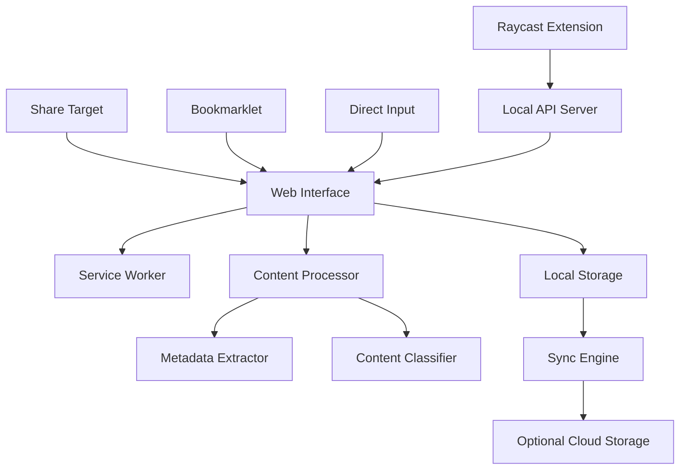

# Design Document

## Overview

Universal Pocket is designed as a progressive web application (PWA) that prioritizes simplicity and universal accessibility. The architecture follows a client-first approach with optional cloud sync, ensuring the app works immediately without setup while providing sync capabilities for users who want them. The system uses intelligent content detection and metadata extraction to automatically organize saved items without user intervention.

## Architecture

### High-Level Architecture



### Core Components

1. **Progressive Web App Shell**: Provides instant loading and offline functionality
2. **Content Processor**: Handles different content types and extracts metadata
3. **Local-First Storage**: Uses IndexedDB for reliable offline storage
4. **Sync Engine**: Optional cloud synchronization for cross-device access
5. **Share Target Handler**: Receives content from other applications
6. **Local API Server**: Lightweight HTTP server for Raycast integration
7. **Raycast Extension**: Native Raycast commands for ultra-fast content saving

## Components and Interfaces

### Frontend Components

#### Main Interface (`/src/components/`)
- **SaveForm**: Universal input form accepting URLs, text, and files
- **ContentList**: Grid/list view of saved items with filtering
- **ContentCard**: Individual item display with preview and actions
- **FilterBar**: Simple content type filtering (All, Articles, Videos, Notes, Social)

#### Service Worker (`/src/sw.js`)
- Handles offline functionality and caching
- Processes background sync for queued items
- Manages share target registration

### Backend Services

#### Content Processing Service
```javascript
interface ContentProcessor {
  processUrl(url: string): Promise<ContentItem>
  processText(text: string): Promise<ContentItem>
  classifyContent(url: string): ContentType
}
```

#### Metadata Extraction Service
```javascript
interface MetadataExtractor {
  extractWebPage(url: string): Promise<WebPageMetadata>
  extractYouTube(url: string): Promise<VideoMetadata>
  extractInstagram(url: string): Promise<SocialMetadata>
}
```

#### Storage Interface
```javascript
interface StorageService {
  save(item: ContentItem): Promise<string>
  getAll(filter?: ContentFilter): Promise<ContentItem[]>
  delete(id: string): Promise<void>
  sync(): Promise<void>
}
```

## Data Models

### ContentItem
```typescript
interface ContentItem {
  id: string
  type: ContentType
  title: string
  content?: string
  url?: string
  thumbnail?: string
  metadata: Record<string, any>
  tags: string[]
  createdAt: Date
  syncStatus: 'local' | 'synced' | 'pending'
}

type ContentType = 'article' | 'video' | 'social' | 'note' | 'link' | 'image'
```

### WebPageMetadata
```typescript
interface WebPageMetadata {
  title: string
  description: string
  image: string
  siteName: string
  author?: string
  publishedDate?: Date
}
```

### VideoMetadata
```typescript
interface VideoMetadata extends WebPageMetadata {
  duration: number
  channelName: string
  viewCount?: number
  embedUrl: string
}
```

## Content Classification Logic

### URL Pattern Matching
- **YouTube**: `youtube.com/watch`, `youtu.be/`, `youtube.com/shorts`
- **Instagram**: `instagram.com/p/`, `instagram.com/reel/`
- **Twitter/X**: `twitter.com/`, `x.com/`
- **Articles**: Common blog/news domains, presence of article schema
- **Default**: Generic link with Open Graph extraction

### Content Type Detection
1. Check URL patterns for known platforms
2. Analyze HTML meta tags and schema.org markup
3. Examine content structure (article tags, video embeds)
4. Fall back to generic link classification

## Error Handling

### Network Errors
- Queue failed metadata extractions for retry
- Show placeholder content with URL until metadata loads
- Graceful degradation for offline scenarios

### Content Extraction Failures
- Save URL with basic title (domain name)
- Retry extraction on next app load
- Allow manual title editing for failed extractions

### Storage Errors
- Implement storage quota management
- Provide export functionality before storage limits
- Clear old items based on user preferences

## Testing Strategy

### Unit Tests
- Content classification accuracy
- Metadata extraction for different platforms
- Local storage operations
- Sync conflict resolution

### Integration Tests
- End-to-end save workflows
- Cross-browser compatibility
- PWA installation and offline functionality
- Share target integration

### Performance Tests
- Large dataset handling (1000+ items)
- Metadata extraction speed
- Offline/online transition smoothness
- Memory usage with cached content

## Raycast Integration

### Raycast Extension Architecture

The Raycast extension provides the fastest possible input method for Universal Pocket, leveraging Raycast's native capabilities for instant access and smart input handling.

#### Core Raycast Commands

1. **Quick Save** (`⌘ + Space` → "save")
   - Accepts any input: URLs, text, clipboard content
   - Auto-detects content type and processes immediately
   - Shows instant feedback with extracted metadata

2. **Save Clipboard** (`⌘ + Space` → "save clipboard")
   - Automatically saves current clipboard content
   - Perfect for quick URL saving from browser address bar
   - Handles multiple clipboard formats (text, URLs, images)

3. **Quick Note** (`⌘ + Space` → "note")
   - Optimized for rapid text input
   - Auto-saves as you type with debouncing
   - Supports markdown formatting

4. **Smart Capture** (`⌘ + Space` → "capture")
   - Context-aware saving based on active application
   - Browser: saves current tab URL
   - Text editor: saves selected text
   - Finder: saves file paths

#### Advanced Raycast Features

**Form-Based Input with Smart Defaults**
```typescript
interface RaycastSaveForm {
  content: string // Auto-populated from clipboard/context
  tags?: string[] // Smart suggestions based on content
  type?: ContentType // Auto-detected, user can override
  title?: string // Auto-extracted, editable
}
```

**Raycast-Specific Optimizations**
- **Instant Preview**: Show content preview while typing
- **Smart Suggestions**: Auto-complete tags and titles based on history
- **Keyboard Shortcuts**: Custom shortcuts for different content types
- **Background Processing**: Save immediately, extract metadata async

#### Local API Server Integration

**Lightweight HTTP Server** (`localhost:3001`)
```javascript
// Raycast Extension → Local API → Web App
POST /api/save
{
  "content": "https://youtube.com/watch?v=...",
  "source": "raycast",
  "context": {
    "activeApp": "Safari",
    "timestamp": "2024-01-15T10:30:00Z"
  }
}
```

**Real-time Communication**
- WebSocket connection for instant UI updates
- Server-sent events for metadata extraction progress
- Automatic fallback to polling if WebSocket unavailable

#### Raycast-Specific UX Enhancements

**Smart Input Detection**
```typescript
function detectInputType(input: string): InputAction {
  if (isURL(input)) return 'save-url'
  if (isYouTubeURL(input)) return 'save-video'
  if (input.length > 500) return 'save-long-note'
  if (containsHashtags(input)) return 'save-tagged-note'
  return 'save-text'
}
```

**Context-Aware Saving**
- **Browser Context**: Auto-extract current tab info
- **Code Context**: Save code snippets with syntax highlighting
- **File Context**: Save file references with metadata
- **Meeting Context**: Save meeting notes with timestamp

**Raycast Actions Integration**
- **Copy Link**: Generate shareable links to saved items
- **Open Original**: Quick access to original content
- **Add Tags**: Bulk tagging operations
- **Export Selection**: Export filtered content

#### Performance Optimizations for Raycast

**Instant Response**
- Local caching of recent saves
- Optimistic UI updates
- Background metadata extraction
- Minimal payload for speed

**Smart Caching Strategy**
```typescript
interface RaycastCache {
  recentSaves: ContentItem[] // Last 50 items
  frequentTags: string[] // Most used tags
  quickActions: RaycastAction[] // User's favorite commands
}
```

## Technical Implementation Details

### Progressive Web App Features
- **Manifest**: Enables installation and share target registration
- **Service Worker**: Handles offline functionality and background sync
- **IndexedDB**: Reliable local storage with good performance
- **Web Share Target API**: Receives shared content from other apps

### Share Target Configuration
```json
{
  "share_target": {
    "action": "/save",
    "method": "POST",
    "enctype": "multipart/form-data",
    "params": {
      "title": "title",
      "text": "text",
      "url": "url",
      "files": [
        {
          "name": "files",
          "accept": ["image/*", "video/*"]
        }
      ]
    }
  }
}
```

### Android Integration Details

**PWA Installation & Share Target**
- User installs PWA from browser (Add to Home Screen)
- Android automatically registers the app as a share target
- App appears in system share menu alongside native apps
- Supports sharing URLs, text, and media files

**Android-Specific Optimizations**
- **Intent Handling**: Properly handle Android share intents
- **Background Processing**: Use service worker for metadata extraction
- **Notification Feedback**: Show save confirmation via notification
- **File Handling**: Support shared images and videos from gallery

**Share Menu Integration**
```javascript
// Handle incoming shares from Android
if ('serviceWorker' in navigator && 'share_target' in navigator) {
  // Process shared content
  const urlParams = new URLSearchParams(window.location.search);
  const sharedUrl = urlParams.get('url');
  const sharedText = urlParams.get('text');
  const sharedTitle = urlParams.get('title');
  
  if (sharedUrl || sharedText) {
    processSharedContent({ url: sharedUrl, text: sharedText, title: sharedTitle });
  }
}
```

### Offline-First Strategy
1. All saves work immediately using local storage
2. Metadata extraction queued for when online
3. Background sync processes queued items
4. Conflict resolution for simultaneous edits across devices

### Performance Optimizations
- Lazy loading of content previews
- Virtual scrolling for large lists
- Debounced search and filtering
- Efficient thumbnail caching strategy

## Security Considerations

### Content Sanitization
- Sanitize extracted HTML content
- Validate URLs before processing
- Prevent XSS in user-generated content

### Privacy
- No tracking or analytics by default
- Local-first data storage
- Optional cloud sync with encryption
- Clear data export/deletion options